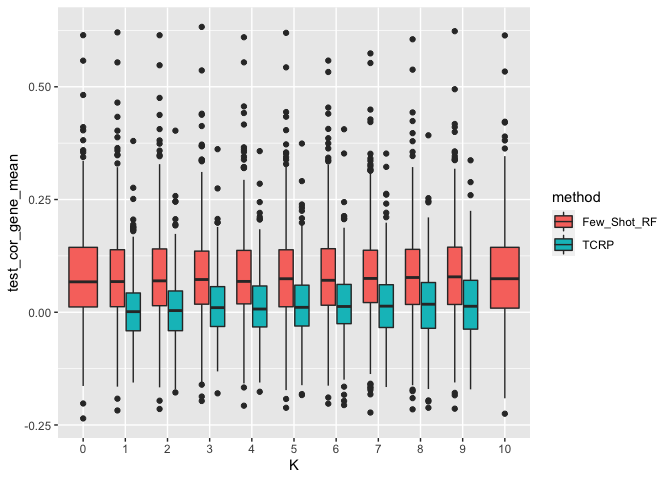
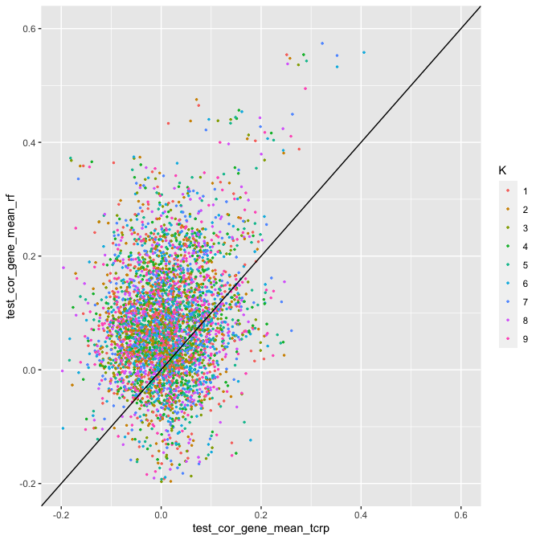
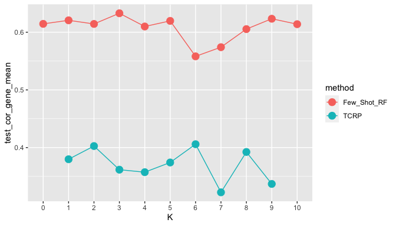
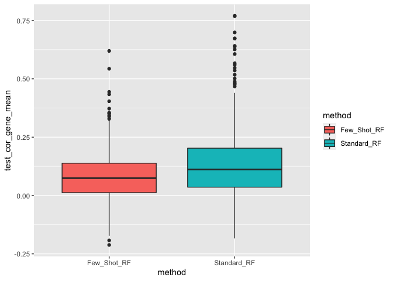
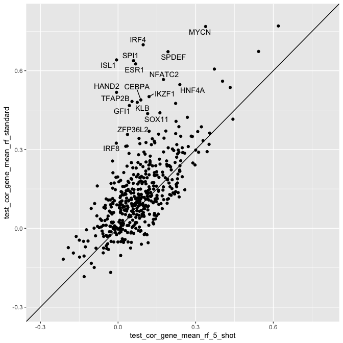
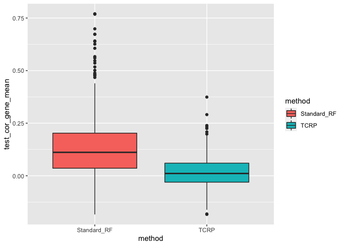
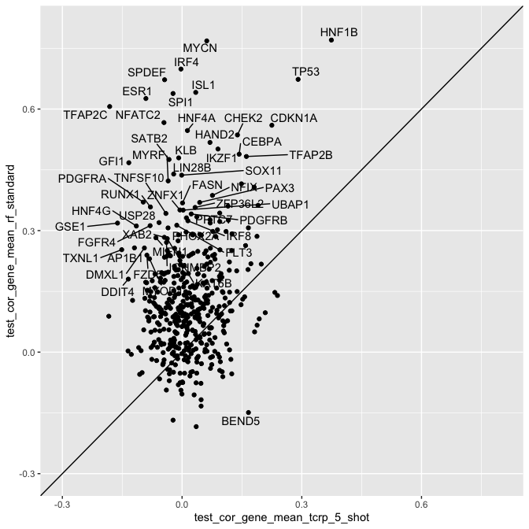

TCRP Achilles Analysis
================
William Colgan
26 February 2021

# Purpose

To analyze the results from our attempt to reproduce Fig. 2a of
*Learning predictive models of drug response that translate across
biological contexts. Nature Cancer*

# Test correlation by K

Plots includes 464 genes that kill at least one cell line. Points
represent average across 5 trials for TCRP and 10 trials for few shot
random forest for each gene and K
value

<!-- -->

<!-- -->

# HNF1B

The paper claims an HNF1B prediction performance of .6 for TCRP and .19
for random
forest.

<!-- -->

# Performance relative to standard random forest

Standard random forest uses the same features but uses standard cross
validation. K value is fixed at 5 for both TCRP and few shot random
forest.

## Few shot vs standard RF

<!-- -->

<!-- -->

## TCRP vs standard RF

<!-- -->

<!-- -->
